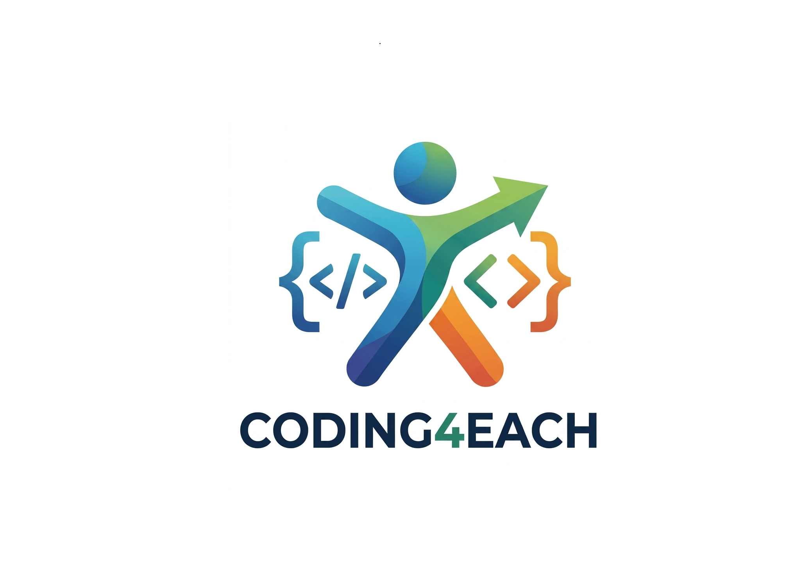

# Basic Python and Coding Concepts
 

### Roadmap Journey : 

## This Repo will contain Basic Python Notebooks along with Coding Concepts in Python

### 📚 Complete Curriculum Structure

| Module | Topic | Description | YouTube | code |
|--------|-------|-------------|------|---------|
| 01 | print function and variablels in Python | Understanding Print Function and its working code with understanding of 'variables' concept | [Link](./00-Introduction/README.md) | 

<!-- CO-OP TRANSLATOR OTHER COURSES END -->
