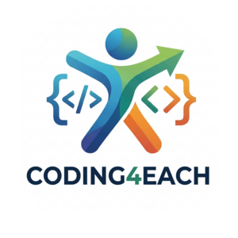

  

    
  # Basic Python and Coding Concepts
 

 

 # Roadmap Journey 

  
 

  
  

## This Repo contains all the Basic Python Concepts along with Practice Notebooks

### 📚 Complete Curriculum Structure

| Serial No. | Topic | Description | YouTube | code |
|--------|-------|-------------|------|---------|
| 01 | print function and variablels in Python | Understanding Print Function and its working code with understanding of 'variables' concept | [Link](./00-Introduction/README.md) | 
| 02 | Basic Data Types | Covering data types like - String, Integer, Float and Boolean | [Link](./00-Introduction/README.md) | 

<!-- CO-OP TRANSLATOR OTHER COURSES END -->
